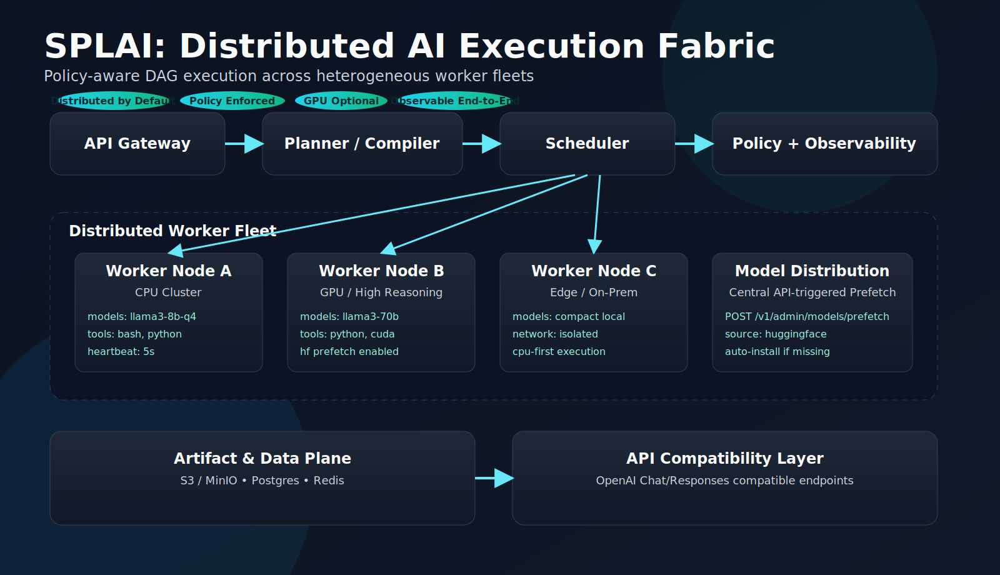

# SPLAI: Distributed AI Execution Fabric

SPLAI is a distributed runtime for AI workloads.
It turns requests into task graphs, schedules them across workers, and returns traceable results.



## What You Can Do With It

- Run AI jobs across many CPU workers (GPU optional)
- Keep execution on your own infrastructure (local, VM, Kubernetes, edge)
- Route and govern model/tool execution with policy controls
- Integrate with existing AI apps via native REST or OpenAI-compatible endpoints

## Quick Start (Beginner-Friendly, Local)

This quickstart is written for first-time users and takes you from zero to a running job.

### 1. Start the API gateway (control plane)

Open terminal A:

```bash
cd /Users/mchenetz/git/SPLAI
go run ./cmd/api-gateway
```

### 2. Start one worker

Open terminal B:

```bash
cd /Users/mchenetz/git/SPLAI
go run ./worker/cmd/worker-agent
```

### 3. Submit your first job

Open terminal C:

```bash
curl -s -X POST http://localhost:8080/v1/jobs \
  -H 'content-type: application/json' \
  -d '{
    "type":"chat",
    "input":"Analyze 500 support tickets and produce root causes.",
    "policy":"enterprise-default",
    "priority":"interactive"
  }' | jq
```

Expected output pattern:

```json
{
  "job_id": "job-1"
}
```

### 4. Check job and task status

```bash
curl -s http://localhost:8080/v1/jobs/job-1 | jq
curl -s http://localhost:8080/v1/jobs/job-1/tasks | jq
```

### 5. Optional: inspect only completed tasks

```bash
curl -s "http://localhost:8080/v1/jobs/job-1/tasks?status=Completed" | jq
```

### 6. Optional: stream live job events (SSE)

```bash
curl -N http://localhost:8080/v1/jobs/job-1/stream
```

Events include:

- `job.snapshot`
- `job.status`
- `task.update`
- terminal event such as `job.completed` / `job.failed`

### 7. Optional: read a local artifact

```bash
cat /tmp/splai-artifacts/job-1/t1-split/output.json | jq
```

For guided docs written in instructional style, use:

- `/Users/mchenetz/git/SPLAI/docs/reference/quickstart.md`
- `/Users/mchenetz/git/SPLAI/docs/reference/user-guide.md`
- `/Users/mchenetz/git/SPLAI/docs/reference/integration-guide.md`

## OpenAI-Compatible Mode (Drop-In for Existing Apps)

Enable compatibility mode:

```bash
SPLAI_OPENAI_COMPAT=true go run ./cmd/api-gateway
```

Supported endpoints:

- `POST /v1/chat/completions`
- `POST /v1/responses`

Current behavior:

- Non-streaming only (`stream=true` is rejected)
- Calls are translated to SPLAI jobs and waited synchronously
- Timeout controlled by `SPLAI_OPENAI_COMPAT_TIMEOUT_SECONDS` (default `60`)

### Python OpenAI SDK

```python
from openai import OpenAI

client = OpenAI(
    base_url="http://localhost:8080/v1",
    api_key="local-dev-token",  # required by SDK; SPLAI ignores unless auth is enabled
)

resp = client.chat.completions.create(
    model="llama3-8b-q4",
    messages=[
        {"role": "system", "content": "You are a support analyst."},
        {"role": "user", "content": "Summarize root causes from these 500 tickets."},
    ],
)

print(resp.choices[0].message.content)
```

### JavaScript OpenAI SDK

```javascript
import OpenAI from "openai";

const client = new OpenAI({
  baseURL: "http://localhost:8080/v1",
  apiKey: "local-dev-token",
});

const resp = await client.chat.completions.create({
  model: "llama3-8b-q4",
  messages: [{ role: "user", content: "Generate top 5 ticket themes." }],
});

console.log(resp.choices[0].message.content);
```

## Integrating With Popular AI Frameworks

### LangChain

Use OpenAI-compatible SPLAI endpoint as the model backend:

```python
from langchain_openai import ChatOpenAI

llm = ChatOpenAI(
    model="llama3-8b-q4",
    base_url="http://localhost:8080/v1",
    api_key="local-dev-token",
)

print(llm.invoke("Classify these support incidents by root cause."))
```

### LlamaIndex

Point `OpenAI` LLM settings at SPLAI compatibility endpoint:

```python
from llama_index.llms.openai import OpenAI

llm = OpenAI(
    model="llama3-8b-q4",
    api_base="http://localhost:8080/v1",
    api_key="local-dev-token",
)

print(llm.complete("Summarize this incident cluster."))
```

## Integrating With Pipeline/Orchestration Tools

### Airflow Pattern

Use an HTTP task (or PythonOperator) to submit and poll SPLAI jobs.

```python
import requests
import time

base = "http://localhost:8080"
job = requests.post(f"{base}/v1/jobs", json={
    "type": "chat",
    "input": "Analyze daily support export and produce root causes",
    "policy": "enterprise-default",
    "priority": "batch",
}).json()

job_id = job["job_id"]
while True:
    status = requests.get(f"{base}/v1/jobs/{job_id}").json()
    if status["status"] in ["Completed", "Failed", "Canceled"]:
        print(status)
        break
    time.sleep(2)
```

### n8n / Zapier / Make Pattern

- Node 1: HTTP `POST /v1/jobs`
- Node 2: Wait/Delay
- Node 3: HTTP `GET /v1/jobs/{id}`
- Node 4: Branch on status (`Completed`/`Failed`)

This pattern gives async reliability with retries and queueing from SPLAI.

## Kubernetes Install (Helm)


OCI chart (published by GitHub Action):

```bash
helm install splai oci://ghcr.io/mchenetz/charts/splai --version <chart-version> -n splai-system --create-namespace
```

Then access gateway locally:

```bash
kubectl -n splai-system port-forward svc/splai-splai-api-gateway 8080:8080
```

## Standalone Planner and Scheduler Services

The `planner` and `scheduler` deployments now run full HTTP services:

- Planner (default `:8081`):
  - `GET /healthz`
  - `POST /v1/planner/compile`
- Scheduler (default `:8082`):
  - `GET /healthz`
  - `POST /v1/scheduler/jobs`
  - `GET /v1/scheduler/jobs/{id}`
  - `GET /v1/scheduler/jobs/{id}/tasks`
  - `POST /v1/scheduler/workers/register`
  - `POST /v1/scheduler/workers/{id}/heartbeat`
  - `GET /v1/scheduler/workers/{id}/assignments`
  - `POST /v1/scheduler/tasks/report`

## Worker Onboarding (Single Command)

Build/install helper binaries:

```bash
make install-worker
```

Join a host as worker:

```bash
splaictl worker join --url http://<gateway>:8080 --service systemd
```

Verify:

```bash
splaictl verify --url http://<gateway>:8080
```

Generate a token for controlled environments:

```bash
splaictl worker token create
```

## Centralized Hugging Face Model Prefetch

Trigger model download on workers from one API call:

```bash
curl -s -X POST http://localhost:8080/v1/admin/models/prefetch \
  -H 'Content-Type: application/json' \
  -d '{
    "model":"meta-llama/Llama-3-8B-Instruct",
    "source":"huggingface",
    "workers":["worker-a","worker-b"],
    "only_missing":true
  }'
```

## Security and Auth

Enable token auth by setting `SPLAI_API_TOKENS`.
When enabled, send bearer tokens in `Authorization: Bearer <token>` (or `X-SPLAI-Token`).

Example:

```bash
SPLAI_API_TOKENS='operator-token:operator|metrics,tenant-a-token:tenant:tenant-a'
```

## Storage, Queue, and Observability

- Persistent state: Postgres (`SPLAI_STORE=postgres`, `SPLAI_POSTGRES_DSN=...`)
- Distributed queue: Redis (`SPLAI_QUEUE=redis`, `SPLAI_REDIS_ADDR=...`)
- Tracing/metrics: OpenTelemetry + Prometheus endpoints

## Key Paths

- Helm chart: `charts/splai/`
- CLI: `cmd/splaictl/`
- Worker runtime: `worker/`
- OpenAPI: `openapi/splai-admin-task.yaml`
- Proto: `proto/splai/v1/`
- Architecture: `docs/architecture/kubernetes-crd-native.md`
- Persistent mode: `docs/reference/persistent-control-plane.md`
- Complete reference: `docs/reference/complete-operations-reference.md`
- Build/release guide: `docs/reference/build-release-registry-helm.md`
